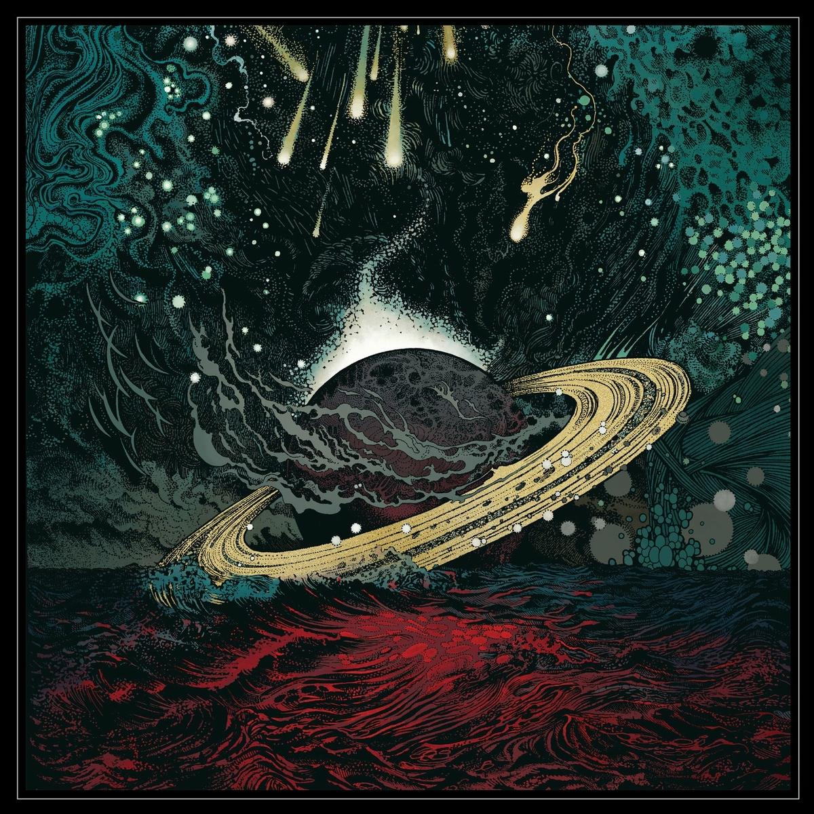
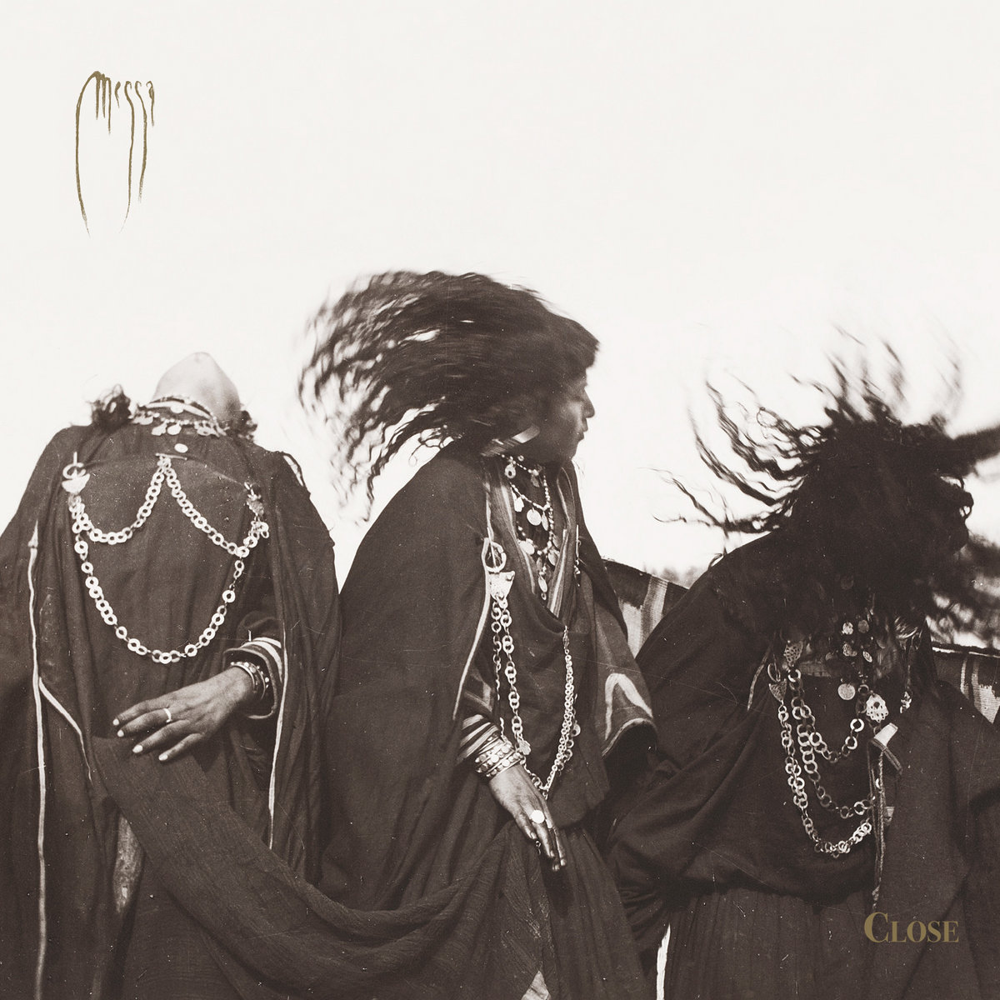
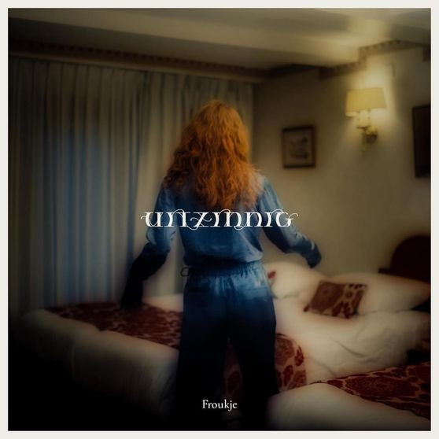
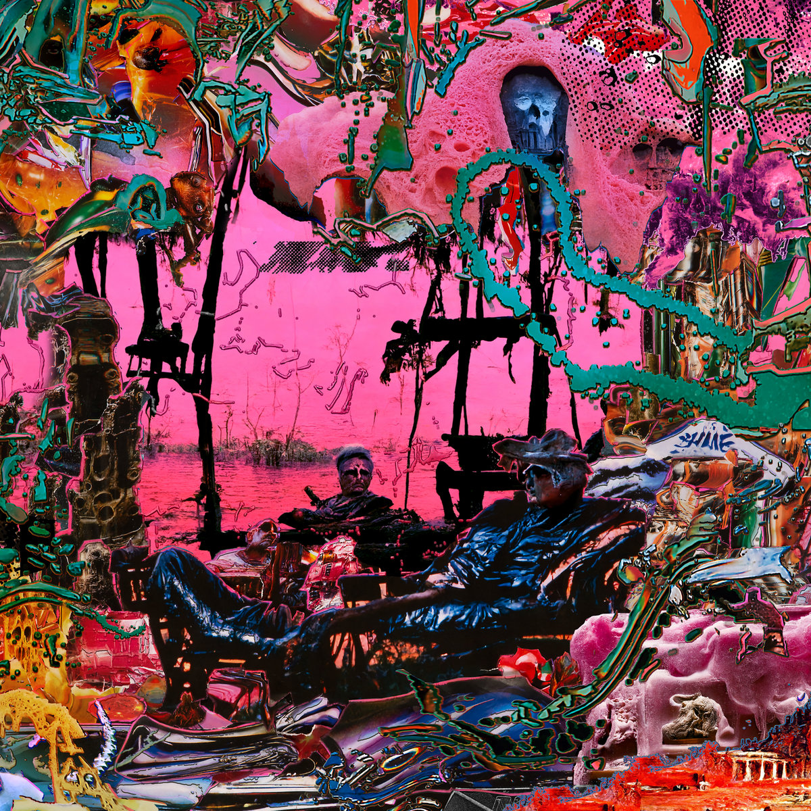
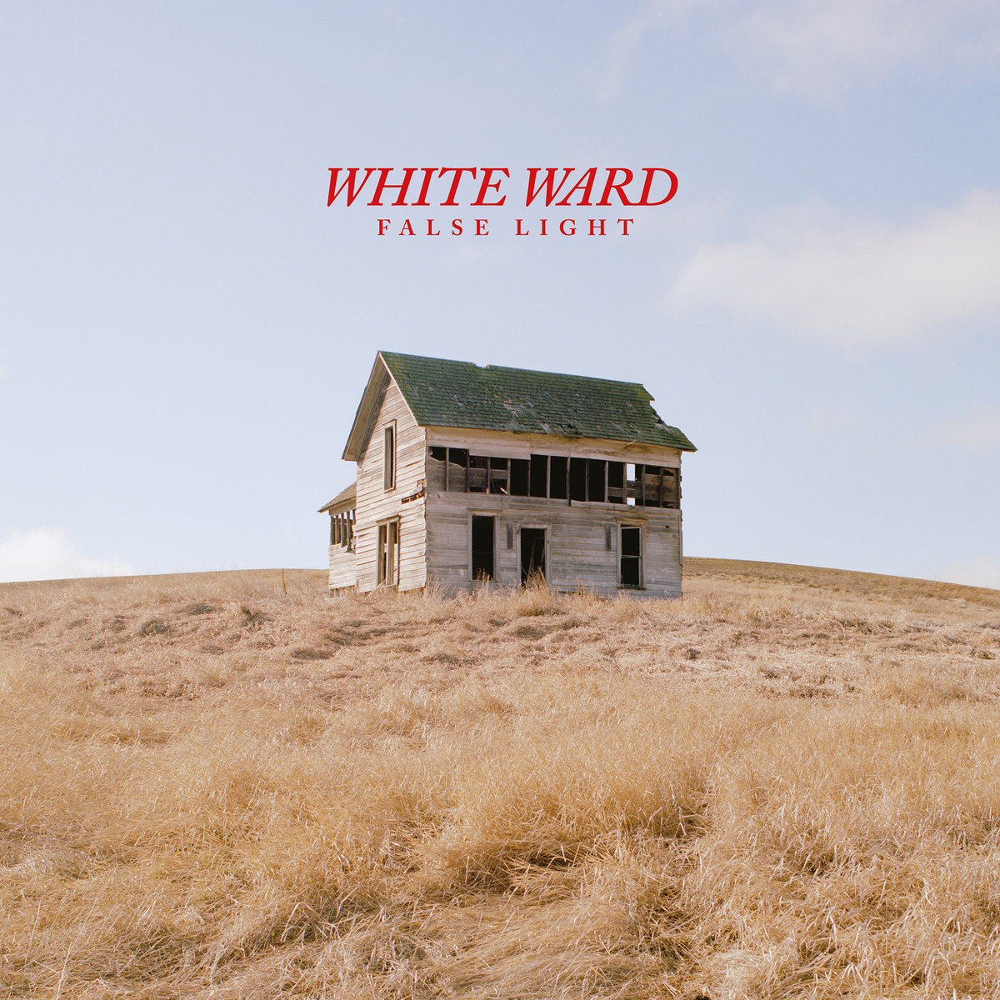
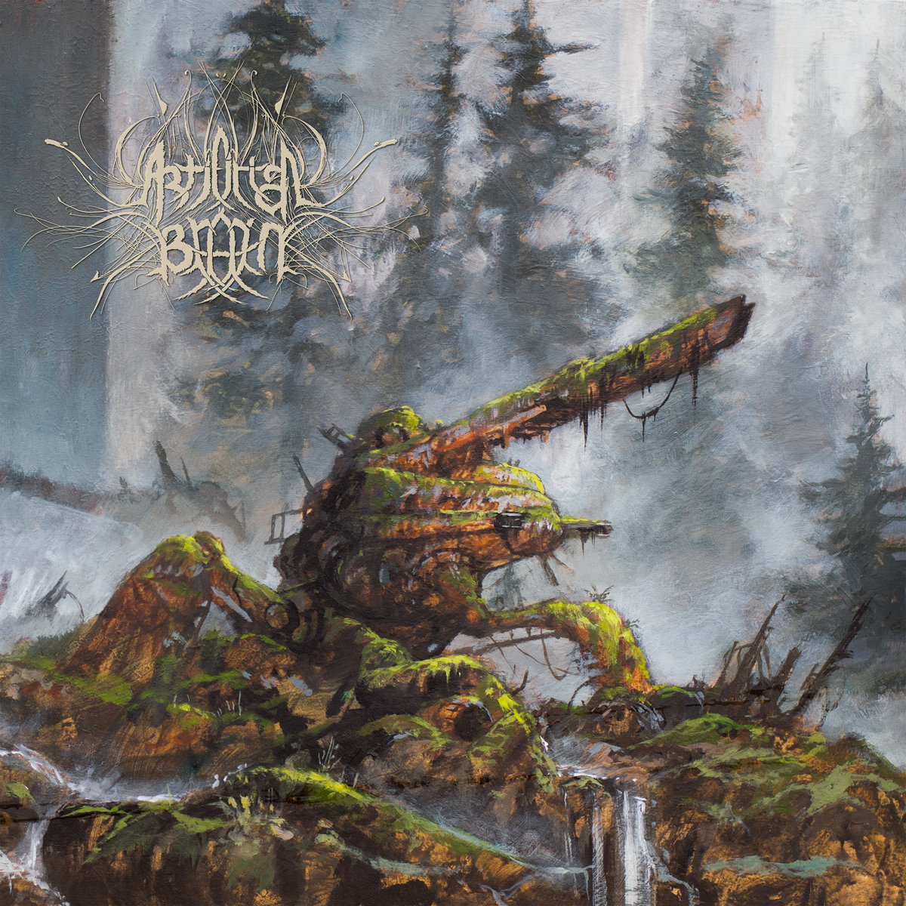
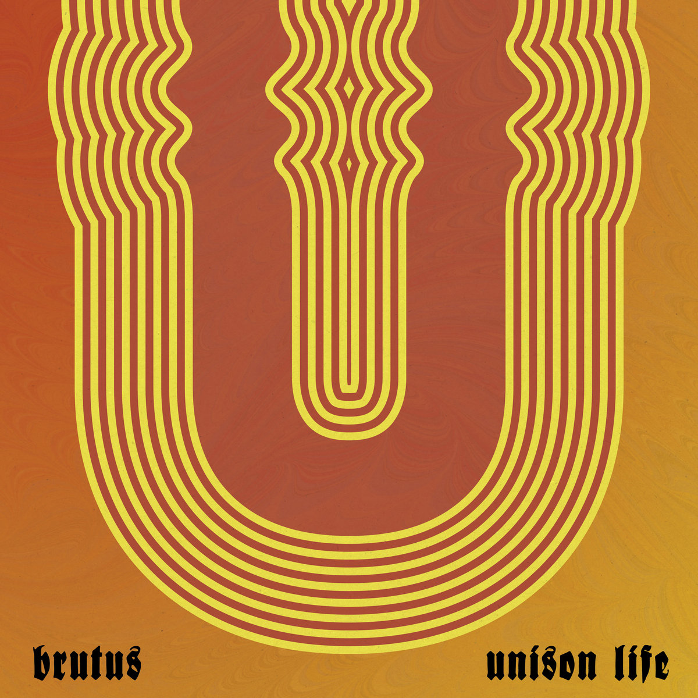
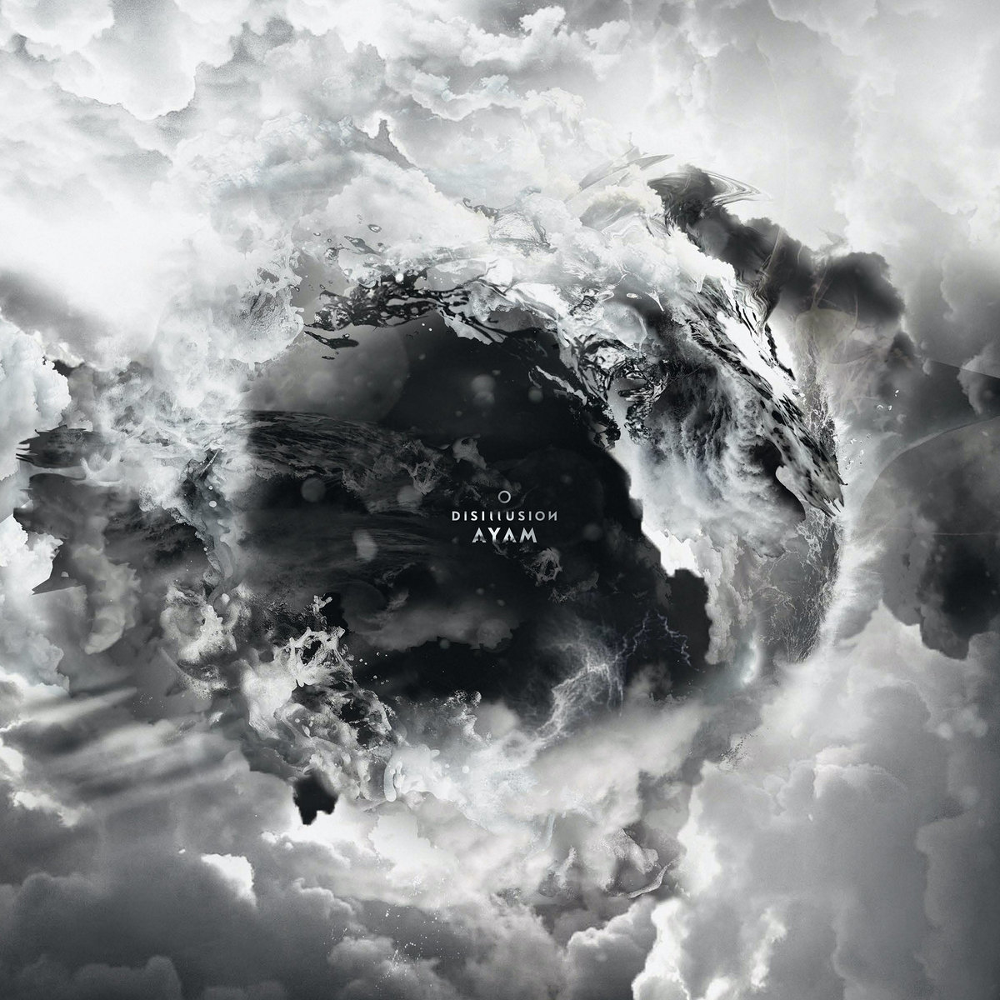

_Last updated 25-12 11:55: The other albums of 2022 added_

2022 has been a great year for music for me personally. I've discovered a lot of great new artists, bands and albums. I've gotten into new genres and went to a lot of concerts (50 acts!) too. There was a lot of metal, but it's also the year where I really started digging into the endless catalogue of music by John Zorn. Where I started listening to Dutch artists like S10 and Froukje and where I've buried my head deep into death-metal and got kind of bored with most black-metal.

How did I create my top 10 of favorite albums? First I made a long list of about 70 albums that I really liked this year. I went through everything I saved in Apple Music, all the stuff I bought on Bandcamp and physical formats like vinyl. Then I sorted everything by hand. Went through the list multiple times. Listened to albums, reordered the list and did this for about a week. In the end I ended up with the list below. Is it my final list? Right now it is, but on different days, with different moods, the order might still change somewhat 🤷.

## The 10 best albums of 2022

    

        <ol class="Albums__list">
            <li class="Album">
                
                

                    <h3 class="Album__title">Cave In - <em>Heavy Pendulum</em></h3>
                    
I actually did not expect Cave In to release another album and especially not one that sounds as good as <em>Heavy Pendulum</em>. It's great, there is lot's of variety and doesn't get boring at all, since this is also a double album, contains 14 songs and lasts 70 minutes in total. It might even be their best album after <em>Jupiter</em> and that says something.

                    

                        <h4>Listen to <em>Heavy Pendulum</em> on:</h4>
                        <a rel="noreferrer noopener" href="https://cavein.bandcamp.com/album/heavy-pendulum">Bandcamp</a> <a rel="noreferrer noopener" href="https://songwhip.com/cavein/heavy-pendulum">Streaming Services</a>

                

            </li>
            <li class="Album">
                
                

                    <h3 class="Album__title">Messa - <em>Close</em></h3>
                    
Messa combine the sounds of Black Sabbath with Arabic music and jazz. Still, it doesn't sound exactly as how you might expect something with that description to sound like. <em>Close</em> was for me the first highlight of the year and has stayed with me for the last couple of months.

                    

                        <h4>Listen to <em>Close</em> on:</h4>
                        <a rel="noreferrer noopener" href="https://messaproject.bandcamp.com/album/close">Bandcamp</a> <a rel="noreferrer noopener" href="https://songwhip.com/messa/close">Streaming Services</a>

                

            </li>
            <li class="Album">
                
                

                    <h3 class="Album__title">Froukje - <em>Uitzinnig</em></h3>
                    
Froukje joins Eefje de Visser in my very short list of modern Dutch pop musicians who sing in Dutch and also make great music. I think Froukje has a bright future ahead, let's just hope her next release will be a proper full length album and not another EP.

                    

                        <h4>Listen to <em>Uitzinnig</em> on:</h4>
                        <a rel="noreferrer noopener" href="https://songwhip.com/froukje/uitzinnig">Streaming Services</a>
                    

                

            </li>
            <li class="Album">
                
                

                    <h3 class="Album__title">black midi - <em>Hellfire</em></h3>
                    
black midi is the amalgation of Mr. Bungle and King Crimson playing post-punk. Whatever these guys do, it seems they almost always strike gold. <em>Hellfire</em> continues down the same road the band went down on their previous album. Still, it's perhaps a bit less dense, a bit more varied and contains better tunes.

                    

                        <h4>Listen to <em>Hellfire</em> on:</h4>
                        <a rel="noreferrer noopener" href="https://bmblackmidi.bandcamp.com/album/hellfire">Bandcamp</a> <a rel="noreferrer noopener" href="https://songwhip.com/black-midi/hellfire-2">Streaming Services</a>

                

            </li>
            <li class="Album">
                
                

                    <h3 class="Album__title">White Ward - <em>False Light</em></h3>
                    
It's even more impressive Ukrainian post-black-metal band White Ward even released an album in the year Russia started a war with their country. <em>False Light</em> isn't an easy listen, but is perhaps the pinnacle of modern (post) black-metal. I love how the band combines dissonant black-metal with saxophone and more atmospheric parts.

                    

                        <h4>Listen to <em>False Light</em> on:</h4>
                        <a rel="noreferrer noopener" href="https://whiteward.bandcamp.com/album/false-light">Bandcamp</a> <a rel="noreferrer noopener" href="https://songwhip.com/white-ward/falselight">Streaming Services</a>

                

            </li>
            <li class="Album">
                
                

                    <h3 class="Album__title">Artificial Brain - <em>Artificial Brain</em></h3>
                    
It took me a while to appreciate this album, but as is often the case, the best albums need to grow a bit. <em>Artificial Brain</em> is impressive in terms of vocals and technicallity. But the album doesn't feel too dense or too dissonant to sit through, you just have to sit down and listen.

                    

                        <h4>Listen to <em>Artificial Brain</em> on:</h4>
                        <a rel="noreferrer noopener" href="https://profoundlorerecords.bandcamp.com/album/artificial-brain">Bandcamp</a> <a rel="noreferrer noopener" href="https://songwhip.com/artificial-brain/artificial-brain">Streaming Services</a>

                

            </li>
            <li class="Album">
                
                

                    <h3 class="Album__title">Brutus - <em>Unison Life</em></h3>
                    
My favorite Belgian post-metal band return with their third album. <em>Unison Life</em> is more melodic and a tiny bit less aggressive than their previous releases. In my book this improved the variation and dynamics of the songs, making this album their best.

                    

                        <h4>Listen to <em>Unison Life</em> on:</h4>
                        <a rel="noreferrer noopener" href="https://wearebrutus.bandcamp.com/album/unison-life">Bandcamp</a> <a rel="noreferrer noopener" href="https://songwhip.com/brutus/unison-life">Streaming Services</a>

                

            </li>
            <li class="Album">
                
                

                    <h3 class="Album__title">GGGOLDDD - <em>This Shame Should Not Be Mine</em></h3>
                    
<em>This Shame Should Not Be Mine</em> is a gripping and emotional post-rock album with a sound that sits comfortably next to Portishead's Third. Which is nothing but praise in my book.

                    

                        <h4>Listen to <em>This Shame Should Not Be Mine</em> on:</h4>
                        <a rel="noreferrer noopener" href="https://gggolddd.bandcamp.com/album/this-shame-should-not-be-mine">Bandcamp</a> <a rel="noreferrer noopener" href="https://songwhip.com/gggolddd/this-shame-should-not-be-mine">Streaming Services</a>

                

            </li>
            <li class="Album">
                
                

                    <h3 class="Album__title">Disillusion - <em>Ayam</em></h3>
                    
<em>Ayam</em> came out of nowhere for me. The album was the first time I was made aware of this German progressive death-metal outfit. It's an impressive mix of progressive melodic death-metal, where the band has written a couple of great songs.

                    

                        <h4>Listen to <em>Ayam</em> on:</h4>
                        <a rel="noreferrer noopener" href="https://disillusion-official.bandcamp.com/album/ayam">Bandcamp</a> <a rel="noreferrer noopener" href="https://songwhip.com/disillusion/ayam">Streaming Services</a>

                

            </li>
            <li class="Album">
                
                

                    <h3 class="Album__title">Wormrot - <em>Hiss</em></h3>
                    
<em>Hiss</em> might be the first grindcore album that I've really, really liked and listened to repeatedly on multiple occasions. This is loud and dense, but also experimental on several tracks, which makes this a lot more interesting for me.

                    

                        <h4>Listen to <em>Hiss</em> on:</h4>
                        <a rel="noreferrer noopener" href="https://wormrot.bandcamp.com/album/hiss">Bandcamp</a> <a rel="noreferrer noopener" href="https://songwhip.com/wormrot/hiss">Streaming Services</a>

                

            </li>
        </ol>
    

## The other albums of 2022

11. High Castle Teleorkestra - _The Egg That Never Opened_
    - The new band from the musicians behind Estradasphere, Mr. Bungle, Secret Chiefs 3 and Farmers Market.
1. Charlotte Wessels - _Tales from Six Feet Under Vol. II_
    - I'm so impressed by the quality of songs Charlotte releases every month, for two years in a row already.
1. S10 - _Ik Besta Voor Altijd Zolang Jij Aan Mij Denkt_
    - Probably the first and last time I feature a Eurovision songfestival candidate in my end of year list. File S10 with Froukje and Eefje under my favorite Dutch artists singing in Dutch.
1. Orville Peck - _Bronco_
    - Orville's Elvis sounding voice might sound a little gimmicky in the beginning, but all songs on _Bronco_ are of the highest quality here.
1. Besvärjelsen - _Atlas_
    - Swedish stoner meets grunge meets occult rock. Strong vocals and songs. You might have missed this one.
1. Mother of Graves - _Where the Shadows Adorn_
    - This is the album for you if you miss Katatonia's _Brave Murder Day_ sound.
1. Terzij de Horde - _In One Of These, I Am Your Enemy_
    - This grew a lot on me in the last few days. The two very long songs might look a little intimidating, but this is not your cookiecutter atmospheric black-metal with boring 15 minutes songs. Not at all!
1. Faceless Burial - _At the Foothills of Deliration_
    - This technical old-school death-metal goes in a lot of directions. Not an easy listen, but highly rewarding.
1. An Abstract Illusion - _Woe_
    - Perhaps this one needs to grow a little more. The progressive death-metal here is great and has the potential to move up some places.
1. Autonoesis - _Moon of Foul Magics_
    - A very impressive blend of black/thrash is what these guys are playing.
1. Imperial Triumphant - _Spirit of Ecstasy_
1. Zola Jesus - _Arkhon_
1. Negative Plane - _The Pact_
1. tricot - _不出来 (Fudeki)_
1. Misþyrming - _Með hamri_
1. Reeking Aura - _Blood and Bonemeal_
1. Oceans of Slumber - _Starlight And Ash_
1. Holy Fawn - _Dimensional Bleed_
1. Amorphis - _Halo_
1. Psychonaut - _Violate Consensus Reality_
1. The Callous Daoboys - _Celebrity Therapist_
1. Obsidious - _Iconic_
1. Everything Everything - _Raw Data Feel_
1. Black Lung - _Dark Waves_
1. Wilderun - _Epigone_
1. Sylvaine - _Noire_
1. Cult of Luna - _The Long Road North_
1. Black Map - _Melodoria_
1. The Halo Effect - _Days of the Lost_
1. In Aphelion - _Moribund_
    - Lot's of shredding, solo's and awesome guitar playing on this impressive and melodic black/death metal album with some thrash/black 'n roll influences.
1. The Gathering - _Beautiful Distortion_
1. Cloud Rat - _Threshold_
1. Druids - _Shadow Work_
1. Hath - _All That Was Promised_
1. Aeternam - _Heir of the Rising Sun_
1. Vorbid - _A Swansong By The Edge of Mandala_
1. thoughtcrimes - _Altered Pasts_
1. Altars - _Ascetic Reflection_
    - Dissonant death-metal from Australia, different from Ulcerate. Taking this sound somewhere else.
1. Mizmor & Thou - _Myopia
1. Verberis - _Adumbration of the Veiled Logos_
1. Ghost - _Impera_
1. Kelly Lee Owens - _LP8_
1. Nils Frahm - _Music For Animals_
1. Devil Master - _Ecstasies of Never Ending Night_
    - A successful combination of Black-metal, deathrock and punk. Between this and Negative Plane you have heard the best of this genre in 2022.
1. Moon Tooth - _Phototroph_
1. Immolation - _Acts of God_
1. Katharos XIII - _Chthonian Transmissions_
    - Doom-metal with saxophone and ethereal vocals. It's slow and moody and feels a little long sometimes, but pretty good still.
