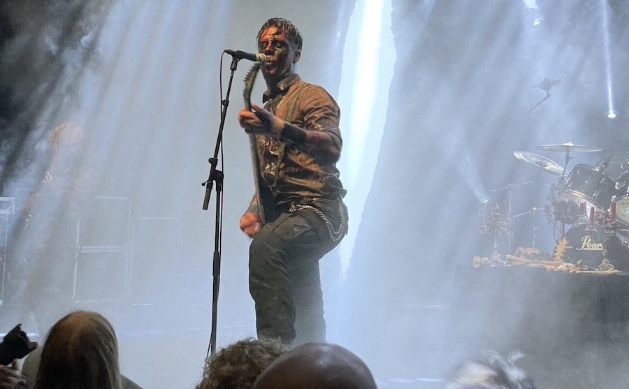

Mijn eerste live show van het jaar was deze keer in Gebr. De Nobel. Ik ging voornamelijk voor de IJslandse black-metal band **Misþyrming**, maar er speelden ook drie andere bands. Eerstgenoemde was met gemak het hoogtepunt van de avond. De band speelde sterk en kwam goed tot hun recht op het grote podium. Ik had echter graag gezien dat ze wat langer speelden.

Van de drie openingsacts vond ik **Kringa** potentieel de interessantste. Ze speelden een soort van zeer chaotische, punkachtige, occulte black-metal. Het Noorse **Ritual Death** moet ik nog eens checken en **Nubivagant** heeft potentie, maar moet nog werken aan zijn songs, die wat aan de langdradige kant zijn (en moet minstens nog een bassist aan de line-up toevoegen). Al met al een geslaagd avondje zware metalen.
