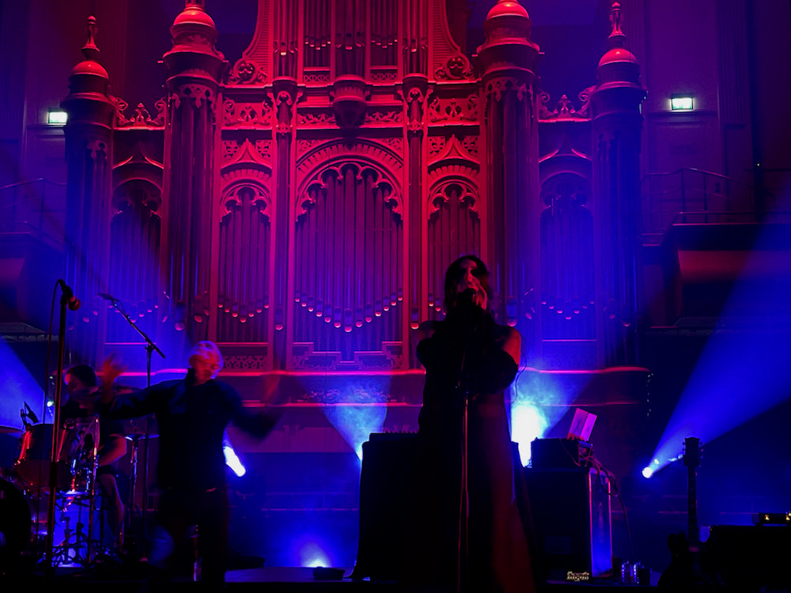

Een relatief rustige week waarbij het hoogtepunt een concert was in het prachtige Philharmonie in Haarlem. De Amerikaanse hardcore band **Converge** bundelde onlangs zijn krachten met **Chelsea Wolfe**, **Ben Chisholm** (de muzikale partner van Chelsea Wolfe) en **Stephen Brodsky** (**Cave In**) en bracht vorig jaar het uitermate goede album **Bloodmoon: I** uit, die ze afgelopen donderdag live uitvoerden.

Het was wel een beetje raar dat er alleen zitplaatsen waren en we dus naar een relatief luidruchtige band moesten luisteren vanaf het comfort van een schouwburg stoel. Het geluid bij **Converge** was de eerste twee nummers niet helemaal lekker, waarbij sommige zang niet goed naar voren kwam. Dat werd gelukkig snel opgelost. Vreemd, want voorprogramma **Hexvessel** (Finland) had een uitermate goed geluid. Meestal is dat andersom. Maar ook die waren lekker op dreef. Ik denk niet dat ik ze eerder in betere vorm heb meegemaakt. Al met al twee shows die ik niet had willen missen.